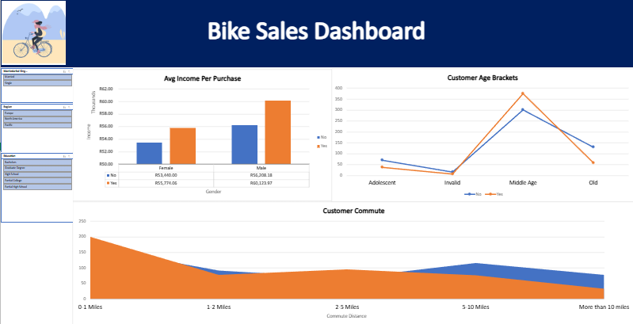

# Interactive Bike Sales Dashboard Using Microsoft Excel

## Project Overview

This project focuses on cleaning, transforming, analyzing, and visualizing customer and sales data using Microsoft Excel.

The objective of the project was to create an interactive dashboard that provides insights into customer demographics, purchasing behavior, income distribution, marital status, and age categories.

The dashboard was created using Pivot Tables, Pivot Charts, Slicers, and Excel formulas to transform raw data into meaningful business insights.

---

# Dashboard Preview

---

# Skills Demonstrated

- Data Cleaning
- Data Transformation
- Data Analysis
- Dashboard Design
- Pivot Tables
- Pivot Charts
- Interactive Reporting
- Data Visualization
- Business Intelligence Fundamentals
- Microsoft Excel

---

# Tools Used

- Microsoft Excel
- Pivot Tables
- Pivot Charts
- Slicers
- IF Functions
- Data Formatting

---

# Project Process

## Data Cleaning

- Converted currency values into South African Rands (R)
- Filtered and validated the dataset
- Removed duplicate records
- Standardized marital status values
- Standardized gender values
- Removed unnecessary decimal values from income data

## Data Transformation

Created a new Age Brackets column using nested IF formulas to group customers into:
- Adolescent
- Middle Age
- Old

## Data Analysis

- Created Pivot Tables to analyze trends
- Customized Pivot Tables for reporting
- Built Pivot Charts for visual analysis

## Dashboard Creation

- Designed an interactive Excel dashboard
- Added slicers for filtering
- Connected slicers across Pivot Tables
- Created an organized and professional dashboard layout

---

# Key Insights

- Middle-aged customers showed higher purchasing activity
- Income levels influenced purchasing trends
- Customer demographics provided useful business insights
- Interactive filtering improved data exploration

---

# Repository Structure

excel-dashboard-project/
│
│── Raw_Dataset.xlsx
├── Dashboard_Screenshot
├── Interactive_Bike_Sales_Dashboard.xlsx
├── README.md

---

# Future Improvements

- Add Power Query transformations
- Create a Power BI version
- Add KPI cards
- Automate dashboard refresh processes

---

# Author

Pheeha Mangena
